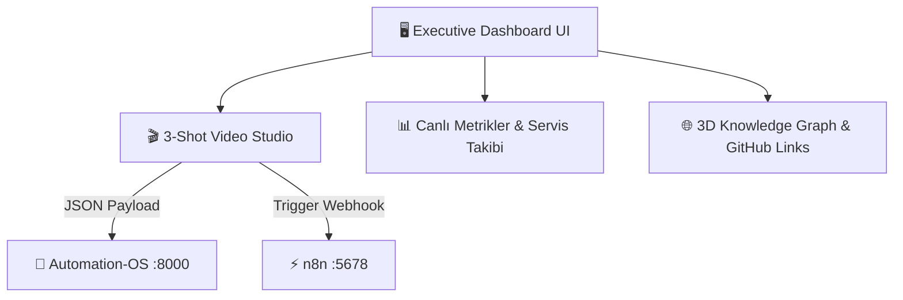

# 🖥️ Voyagerroc Automation Dashboard

> Ekosistemin tüm metriklerini, n8n iş akışlarını, servis durumlarını ve **3-Shot (30s) Sinematik Video Stüdyosunu** tek bir görsel merkezden yöneten **Yönetim Paneli**.

---

## 🏛️ Dashboard Mimarisi ve Arayüz Şeması



---

## 🚀 Çalıştırma & Kullanım
- `index.html` dosyasını doğrudan herhangi bir tarayıcıda çift tıklayarak açabilirsiniz.
- Veya yerel bir HTTP sunucusu ile ayağa kaldırabilirsiniz:
```bash
# Node ile anında başlatma
npx serve public
```

---
© 2026 Voyagerroc Automation. All rights reserved.