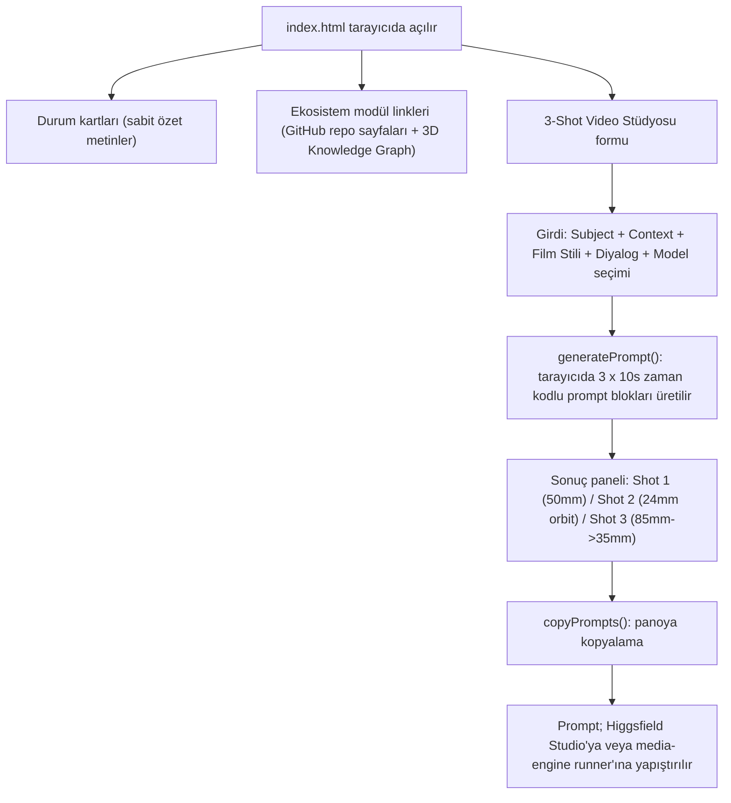

# Voyagerroc Automation Dashboard

Ekosistemin **tek dosyalık, statik yönetim paneli** (`index.html`). Tarayıcıda açıldığında; ekosistem modüllerine hızlı bağlantılar, özet durum kartları ve asıl işlevi olan **3-Shot (30s) Sinematik Video Stüdyosu** formunu gösterir. Formu doldurduğunuzda, video modellerine (Seedance / VEO / Sora) verilecek 3 x 10 saniyelik, zaman kodlu "master prompt" metnini üretir ve tek tıkla panoya kopyalamanızı sağlar.

> **Durum:** Ön yüz prototipi. Sayfa tamamen istemci tarafında çalışır: prompt üretimi tarayıcıdaki JavaScript ile yapılır, form henüz `automation-os` API'sine istek atmaz ve durum kartlarındaki sayılar sabittir. Stil için Tailwind CDN kullanıldığından ilk açılışta internet bağlantısı gerekir.

## Panelde gerçekte ne var?



## Çalıştırma

Derleme adımı yoktur:

```bash
# 1) Doğrudan: index.html dosyasına çift tıklayın
# 2) veya yerel bir HTTP sunucusu ile (depo kökünden):
npx serve .
```

## Klasör yapısı

```
automation-dashboard/
├── index.html            # Panelin tamamı (HTML + Tailwind CDN + vanilla JS) — tek kaynak
├── src/
│   ├── components/       # (henüz boş - ileride bileşenlere ayrılması planlanıyor)
│   └── styles/           # (henüz boş)
├── docs/                 # (henüz boş)
└── README.md
```

## Ekosistem: Voyagerroc-Automation

Bu depo, Voyagerroc-Automation organizasyonundaki içerik/otomasyon ekosisteminin bir parçasıdır:

| Depo | Rolü |
| --- | --- |
| [automation-os](https://github.com/Voyagerroc-Automation/automation-os) | Orkestrasyon beyni ve API kapısı |
| [content-engine](https://github.com/Voyagerroc-Automation/content-engine) | İçerik / senaryo ve hook üretimi |
| [media-engine](https://github.com/Voyagerroc-Automation/media-engine) | Video / ses / görsel işleme ve render |
| [voyagerroc-agents](https://github.com/Voyagerroc-Automation/voyagerroc-agents) | Otonom ajanlar (yönetmen katmanı) |
| **automation-dashboard** (bu depo) | İzleme ve kontrol paneli |
| [infrastructure](https://github.com/Voyagerroc-Automation/infrastructure) | Docker / Redis / nginx altyapısı |
| [giant-automation-library](https://github.com/Voyagerroc-Automation/giant-automation-library) | n8n iş akışları |
| [youtube-shorts-pipeline](https://github.com/Voyagerroc-Automation/youtube-shorts-pipeline) | Yayınlama (YouTube Shorts) |

---
© 2026 Voyagerroc Automation. All rights reserved.
